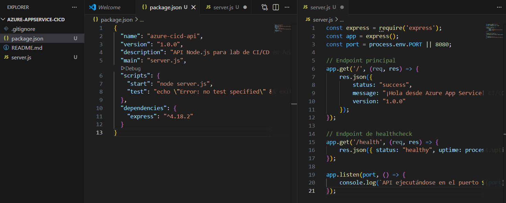
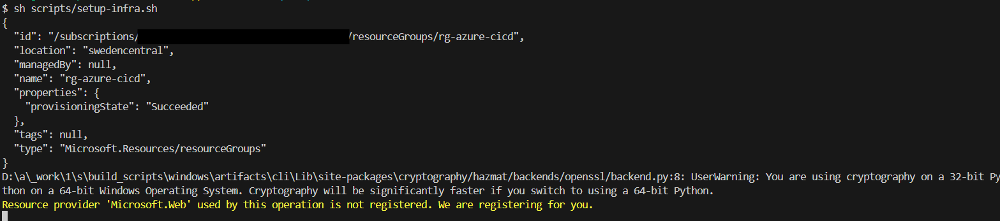

# Automated Azure CI/CD Pipeline for Containerized Node.js API

This repository documents a high-level technical lab focused on modern DevOps practices. I have implemented a fully automated **CI/CD pipeline** that deploys a containerized Node.js application to **Azure App Service** using **GitHub Actions** and a passwordless authentication model via **OpenID Connect (OIDC)**.

## Project Overview
The goal of this project was to move away from manual deployments and legacy credentials, embracing **Infrastructure as Code (IaC)** and **Federated Identity** for a secure, scalable, and automated cloud workflow.

### Key Technical Achievements:
- **Zero-Password Security:** Implemented OIDC to eliminate the need for long-lived Azure secrets.
- **Containerization:** Built a lightweight Docker image using Node.js 20-Alpine.
- **Automated Infrastructure:** Used Azure CLI scripts to provision cloud resources.
- **Continuous Deployment:** Achieved 100% automated delivery from code push to live production.

### Repository Organization:

- root/: Contains the core API logic (server.js) and the container definition (Dockerfile).
- .github/workflows/: Houses the deploy.yml file, which defines the automated CI/CD logic.
- scripts/: Contains the setup-infra.sh script used for idempotent infrastructure provisioning via Azure CLI.
---

## Step-by-Step Implementation

### 1. Local Development & Environment Setup
The project began by initializing a local Git repository and developing a RESTful API using Express.js.

*VS Code environment showing the Node.js API logic and Dockerfile configuration.*

### 2. Infrastructure as Code (IaC)
Instead of using the Azure Portal GUI, I utilized the **Azure CLI** to provision the Resource Group, App Service Plan (F1 Free Tier), and the Web App for Containers.

*Execution of the `setup-infra.sh` script, automating the creation of resources in Sweden Central.*

### 3. Security & Identity Management (OIDC)
I configured a **Federated Identity Trust** between GitHub and Azure. This allows GitHub Actions to request short-lived access tokens, significantly reducing the attack surface.

**Identity Components:**
- **App Registration:** Created a dedicated identity for the GitHub robot.
- **RBAC:** Assigned the `Contributor` role to the identity.
- **Secrets:** Securely stored the Client, Tenant, and Subscription IDs in GitHub.

| Federated Trust Configuration | Role-Based Access Control (IAM) |
|:---:|:---:|
|  |  |

*Encrypted repository secrets used for Azure authentication.*

### 4. CI/CD Pipeline Logic
The GitHub Actions workflow automates the following steps on every push to the `main` branch:
1. **Authentication:** Login to Azure via OIDC.
2. **Build:** Create a Docker image and tag it for the GitHub Container Registry (GHCR).
3. **Registry Push:** Securely upload the image to GHCR.
4. **Deploy:** Notify Azure App Service to pull the latest image and restart the container.

*Pipeline execution history showing successful builds and deployments.*

---

## Final Result & Verification
The transition from a provisioned empty state to a fully functional API is handled entirely by the automation.

**Before Deployment (Cold Start/Placeholder):**

**After Automated Deployment:**

*The API is live and serving JSON responses from a containerized environment in Azure.*

---

## Troubleshooting & Key Learnings
- **Regional Compliance:** Encountered `RequestDisallowedByAzure` policies in certain regions; adapted the IaC script to deploy in **Sweden Central** for full service availability.
- **Permission Scoping:** Resolved GHCR authorization issues by explicitly defining `packages: write` permissions in the YAML workflow, adhering to the **Principle of Least Privilege**.
- **Cost Management:** Implemented a cleanup protocol to de-provision all resources immediately after verification, ensuring zero unnecessary credit consumption.

**GHCR Authorization Challenge:**
The initial pipeline execution failed during the "Build and Push" stage with a "403 Forbidden" error. This occurred because, by default, the GitHub Actions token (GITHUB_TOKEN) is restricted to read-only access for security reasons. To resolve this, I explicitly configured the workflow permissions to include packages: write. This ensures the automated agent has the necessary rights to create and update container images within the GitHub Container Registry.

---
*Created by Alberto Pérez - Aspiring Cloud Engineer*
